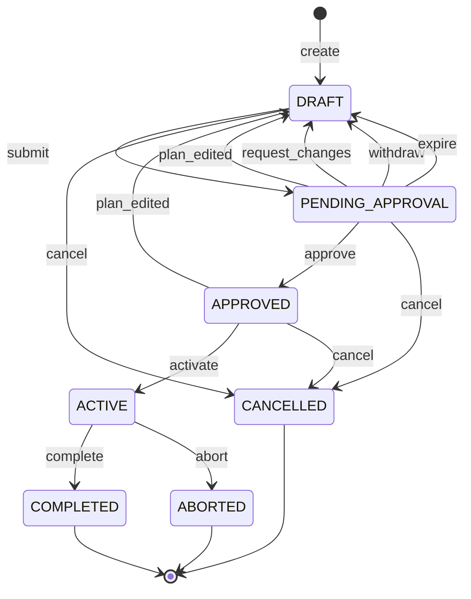
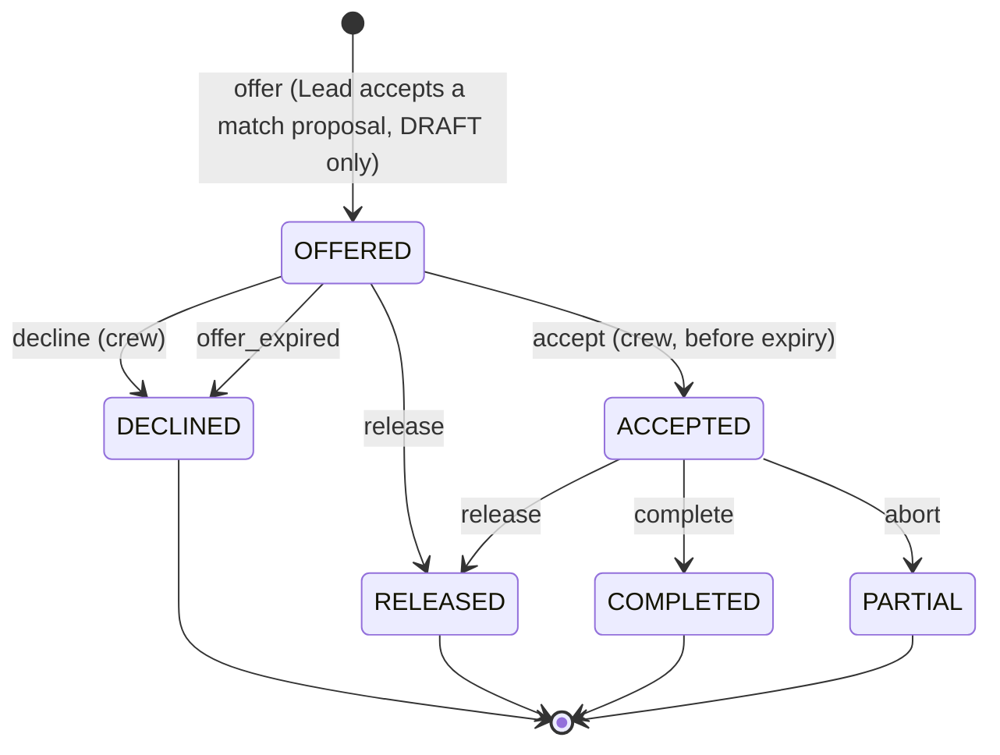

# Mission Control — Design Document

A multi-tenant platform for crewing missions. Organisations are tenants; members hold
one of three roles; missions move through an approval lifecycle; an auto-matching
engine suggests crew based on skills, availability and constraints. This document is based
the requirements defined in https://mutinex.notion.site/Mission-Control-Senior-Software-Engineer-Challenge-9a7fdc6de61b4eb5b8e4ef6ef6d8e4b1

---

## 1. Definitions

- **Tenant** - A Tenant represents an Organization. There can be multiple tenants in the System at any given point in time. Data cannot be shared between tenants. 
- **Mission** - A mission is akin to a Project that a tenant undertakes. A mission has a start and end date. It also depicts what resources are required to full the mission. A mission can only be fulfilled by resources available to a tenant.
- **Roles** - A tenant can have members with one of three roles
    - Crew Member - These are the folks that are allocated to missions. They can accept/reject a mission assignment. They can also depict their unavailabilities when they dont want to be assigned missions.
    - Mission Lead - Are those who Plan and Manage missions. They are responsible for maintaining the lifecycle of Missions and arranging for resources. They can only view and manage their own Missions and not those created by others. 
    - Directors - Are those run the organization. They can approve missions and can view all the ongoing missions. 
- **Assignments** - This is the auto-matcher that allocates Crew Members to Missions.

---

## 2. Design Decisions

- For the purposes of this exercise the system maintains a Dictionary of Tenant Ids to Tenant Objects. In a real world we would want this persisted in a database or a cache. 
- This exercise does not implement Authentication/Authorization of tenants. The user of the API/CLI can assume any role within any tenant. In a real world the isolation would be implemented via OAuth or similar.
- Once the caller assumes a role within a tenant, the features available would be based on that role.
- Immutability and Concurrency - All of the model objects are Immutable. This is to avoid the need to lock objects for updates, rather use Copy-On-Writes.
- A Mission Lead cannot be a crew member. Likewise a Director cannot be a Mission Lead or a Crew Member.
- Crew allocations happen in terms of days, not hours. For this exercise weekends are included in the allocation. Only the days a crew has marked themselves as unavailable are discarded during matching. 
- A crew needs to be fully available for the duration of the mission to be considered. No partial allocations.
- Directors can set the skills and proficiencies for a tenant. And create members - these can be other Directors, Mission Leads or Crew Members.
- Once a crew member accepts a mission, they cannot change their mind or withdraw. In a real world scenario, this feature would be needed in the workflow.

---

## 3. Domain model

```
Platform
└── tenants: dict[TenantId, Tenant]          ← the only global structure
    └── Tenant  (an organisation: space agency, research lab, private company)
        ├── settings:        TenantSettings
        ├── skill_taxonomy:  SkillTaxonomy       tenant-defined skills
        ├── members:         dict[MemberId, Member]        Director|MissionLead|Crew
        ├── crew_profiles:   dict[MemberId, CrewProfile]   skills + availability
        ├── missions:        dict[MissionId, Mission]
        ├── assignments:     dict[AssignmentId, Assignment]
        └── audit:           list[AuditEvent]              append-only
```

---

## 4. Multi-tenancy

### 4.1 The sandbox

Each tenant is a self-contained object; **all** of its state lives inside it. The
platform holds one map and nothing else.

### 4.2 The "Authenticated" object

**`Actor`** It's the authenticated caller identity: the answer
to "who is making this request, on behalf of which organisation, with what
authority". A Director, a Mission Lead and a Crew member all arrive as an `Actor` —
they differ in the `role` field. For the purposes of this exercise, its the role 
the caller has assumed before making any functional calls which require the object
to be passed in. For a Production scenario this will be replaced by the OAuth token.

### 4.3 Concurrency and Immutable objects

Domain objects are `@dataclass(frozen=True)`. Mutations go through the service layer
and produce a **new** object with `version = old.version + 1`, replacing the entry in
the tenant's dict.
Every mutation is a compare-and-swap on `version`. A caller that read version 4
and writes expecting 4 either wins or gets `StaleVersion` and retries against fresh
state. No lost updates, no lock held across the read-modify-write.

#### Snapshot reads, for free

The frozen dataclasses are what make this cheap. To read consistently, capture the
tenant's collections under the lock and release it immediately — the *values* are
immutable, so the snapshot stays coherent without holding anything:

#### The races, and where each resolves

| Race | Resolution |
|---|---|
| Availability edited during a matcher run | Accepted; `offer` re-validates |
| Two Leads offer the same member for overlapping windows | By design — `OFFERED` takes no hold; first `accept` wins |
| One member accepts two overlapping offers concurrently | **The one race needing a lock** — conflict-check and write must be atomic per crew member |
| Lead submits while the last crew member accepts | Benign; `submit` either sees `FULLY_CREWED` or fails under-crewed |
| Director approves while the Lead edits the plan | The state machine handles it — `plan_edited` → `DRAFT`, so `approve` is `IllegalTransition` |
| Two Directors approve simultaneously | Version CAS; one gets `StaleVersion` |
| Availability edit vs an `ACCEPTED` assignment | Rejected outright |


## 5. Members, crew profiles, skills

### 5.1 Members and roles

```python
class Role(str, Enum):
    DIRECTOR = "director"
    MISSION_LEAD = "mission_lead"
    CREW = "crew"
```

A member can hold only one role at a given point in time. And the role is set when 
the Member object is created. It cannot be changed. 
There is no provision to update/delete members in this exercise. Something to consider
for future iterations.

### 5.2 Skills and proficiency

Each tenant defines its own taxonomy, since a space agency and a research lab share
no vocabulary.

```python
class Proficiency(IntEnum):
    BEGINNER = 1; COMPETENT = 2; PROFICIENT = 3; EXPERT = 4; MASTER = 5

@dataclass(frozen=True)
class Skill:                       # tenant taxonomy entry
    id: SkillId
    name: str

@dataclass(frozen=True)
class CrewSkill:                   # a crew member's claim to a skill
    skill_id: SkillId
    level: Proficiency
```

### 5.3 Availability

**Available by default.** A crew member is available unless something says otherwise,
and only two things can say otherwise:

```python
@dataclass(frozen=True, order=True)
class TimeWindow:
    start: datetime
    end: datetime
    def overlaps(self, other: TimeWindow) -> bool: ...

@dataclass(frozen=True)
class UnavailabilityBlock:          # crew-declared; no "kind" field
    window: TimeWindow
    reason: str | None              # display only; never interpreted


def is_available(crew, mission_window, ws) -> bool:
    return not any(
        b.window.overlaps(mission_window)
        for b in blocking_windows(crew, ws)      
    )
```

Availability is a **boolean**: a crew member either has no conflict
with the mission window or they do.

## 6. Authorisation

### 6.1 Two layers

Authorisation answers two different questions that need different machinery:

| Layer | Question | Depends on |
|---|---|---|
| **Capability** | Can this member approve any mission?? | role only |
| **Contextual policy** | Can this Lead approve *this* mission? | actor + target + state |


### 6.2 Capability matrix

```python
class Permission(str, Enum):
    ORG_SETTINGS_MANAGE, MEMBER_MANAGE, AUDIT_READ
    MISSION_CREATE, MISSION_UPDATE, MISSION_SUBMIT, MISSION_APPROVE,
    MISSION_REJECT, MISSION_CANCEL, MISSION_ACTIVATE, MISSION_COMPLETE
    MISSION_VIEW_ALL, MISSION_VIEW_ASSIGNED
    CREW_PROFILE_READ_ALL, CREW_PROFILE_WRITE_OWN, CREW_AVAILABILITY_WRITE_OWN
    MATCHER_RUN, ASSIGNMENT_OFFER, ASSIGNMENT_RESPOND_OWN
```

| Permission | Director | Lead | Crew |
|---|:--:|:--:|:--:|
| `ORG_SETTINGS_MANAGE`, `MEMBER_MANAGE`, `AUDIT_READ` | ● | | |
| `MISSION_CREATE` | | ● | |
| `MISSION_UPDATE`, `MISSION_SUBMIT` | | ●¹ | |
| `MATCHER_RUN`, `ASSIGNMENT_OFFER` | | ●¹ | |
| `MISSION_ACTIVATE`, `MISSION_COMPLETE` | | ●¹ | |
| `MISSION_APPROVE`, `MISSION_REJECT` | ● | | |
| `MISSION_CANCEL` | ●² | ●¹ | |
| `MISSION_VIEW_ALL` | ● | ● | |
| `MISSION_VIEW_ASSIGNED` | ● | ● | ● |
| `CREW_PROFILE_READ_ALL` | ● | ●³ | |
| `CREW_PROFILE_WRITE_OWN`, `CREW_AVAILABILITY_WRITE_OWN` | | | ● |
| `ASSIGNMENT_RESPOND_OWN` | | | ● |

### 6.3 Contextual policies

```python
class Policy(Protocol):
    def check(self, actor: Actor, target: Any, ctx: Workspace) -> Denial | None: ...
```

Three policies cover the brief:

**`OwnershipPolicy`** — a Mission Lead may act only on missions where
`mission.created_by == actor.member_id`.

**`SeparationOfDuties`** — the centrepiece:

```python
def check(self, actor, mission, ctx):
    if actor.member_id in {mission.created_by, mission.submitted_by}:
        return Denial("SELF_APPROVAL", "You cannot approve a mission you authored or submitted.")
    return None
```

**`VisibilityPolicy`** — Crew have "limited visibility into the broader
organisation", which is a *scoping* concern, not a pass/fail one:

```python
def visible_missions(actor: Actor, ctx: Workspace) -> Iterator[Mission]:
    if actor.has(MISSION_VIEW_ALL):
        return iter(ctx.missions.values())
    return (m for m in ctx.missions.values() if _has_assignment(actor, m))
```

## 7. Mission lifecycle

### 7.1 States

Seven states, and **one invariant that replaces most of the machinery**:

> **Any edit to the plan returns the mission to `DRAFT`.**

This machine covers *authorisation* — the Lead's and Director's path. Crew accepting
and declining is a **second, separate machine** on the assignment.



| State | Plan editable? | Matcher? | Effect of editing | Crew visibility |
|---|:--:|:--:|---|---|
| `DRAFT` | yes | **only here** | stays `DRAFT` | offered/accepted crew |
| `PENDING_APPROVAL` | yes | no | **→ `DRAFT`** | offered/accepted crew |
| `APPROVED` | yes | no | **→ `DRAFT`** | assigned crew |
| `ACTIVE` | no | no | rejected† | assigned crew |
| `COMPLETED` / `CANCELLED` / `ABORTED` | no | no | rejected | assigned crew |

### 7.2 The transition table

| From | Event | To | Permission | Policies | Guards | Effects |
|---|---|---|---|---|---|---|
| `DRAFT` | `run_matcher` | `DRAFT` | `MATCHER_RUN` | Ownership | `DRAFT` only | offer unfilled slots; **pin `ACCEPTED`** |
| `DRAFT` | `plan_edited` | `DRAFT` | `MISSION_UPDATE` | Ownership | — | bump `plan_version`; release assignments per §6.7 |
| `DRAFT` | `submit` | `PENDING_APPROVAL` | `MISSION_SUBMIT` | Ownership | ≥1 requirement; window valid & future; **every mandatory slot `ACCEPTED`** | record `submitted_by`; set `pending_expires_at` |
| `PENDING_APPROVAL` | `approve` | `APPROVED` | `MISSION_APPROVE` | **SeparationOfDuties** | roster revalidated (§6.8) | record approver + `plan_version`; notify crew |
| `PENDING_APPROVAL` | `plan_edited` | `DRAFT` | `MISSION_UPDATE` | Ownership | — | as above |
| `PENDING_APPROVAL` | `request_changes` | `DRAFT` | `MISSION_REJECT` | SeparationOfDuties | reason non-empty | record feedback; notify Lead + crew |
| `PENDING_APPROVAL` | `withdraw` | `DRAFT` | `MISSION_SUBMIT` | Ownership | — | clear `submitted_by` |
| `PENDING_APPROVAL` | `expire` ⚙ | `DRAFT` | — (system) | — | `now > pending_expires_at` | notify Lead + crew |
| `APPROVED` | `activate` | `ACTIVE` | `MISSION_ACTIVATE` | Ownership | `CrewingStatus == FULLY_CREWED`; mandatory slots cannot be waived | — (crew already `ACCEPTED`) |
| `APPROVED` | `plan_edited` | `DRAFT` | `MISSION_UPDATE` | Ownership | — | release un-accepted; release accepted only if requirements changed |
| `ACTIVE` | `complete` | `COMPLETED` | `MISSION_COMPLETE` | Ownership | window ended, or early with a reason | write assignment history |
| `ACTIVE` | `abort` | `ABORTED` | `MISSION_CANCEL` | — | reason non-empty | write partial history |
| any pre-active | `cancel` | `CANCELLED` | `MISSION_CANCEL` | Ownership (Leads) | reason non-empty | release all assignments; notify crew |

### 7.3 Events and audit

Every successful transition appends an immutable record:

```python
@dataclass(frozen=True)
class MissionEvent:
    at: datetime; actor_id: MemberId; actor_role: Role
    event: str; from_state: MissionState; to_state: MissionState
    reason: str | None; plan_version: int
    metadata: Mapping[str, Any]
```

The event log is the audit truth; `mission.state` is a cached projection of it. This
answers "who approved this, when, against which version of the requirements, and had
anyone objected first" — which for an approval workflow isn't a nice-to-have, it's
the reason the workflow exists.

### 7.4 Running the matcher, and what it invalidates

**The matcher runs in `DRAFT` only** 
**Re-running it replaces the roster.**

---

## 8. Assignment lifecycle

### 8.1 States



| State | Hold on availability | Meaning |
|---|:--:|---|
| `OFFERED` | **none** | asked, not booked; expires |
| `ACCEPTED` | **hard** | **booked** |
| `DECLINED` | none | said no, or let the offer lapse |
| `RELEASED` | none | booking freed — mission died or changed under them |
| `COMPLETED` | none | flew it; assignment history |
| `PARTIAL` | none | flew part of an aborted mission; history |

`ACCEPTED → RELEASED` is what frees crew when a mission is cancelled, aborted, or has its
requirements changed, and when a member is deactivated. Without it a cancelled mission
would hold its crew's dates forever.

`COMPLETED`/`PARTIAL` are terminal *records* rather than descriptions of an ongoing
situation: they release the availability hold (a real state change) and they're the
assignment history the fairness key reads, where "flew it" and "flew part of an aborted
mission" shouldn't need re-deriving from a mission record years later.

### 8.2 Transitions

| From | Event | To | Who | Guards | Effects |
|---|---|---|---|---|---|
| — | `offer` | `OFFERED` | Lead (`ASSIGNMENT_OFFER`) | mission is `DRAFT`; slot unfilled | notify crew; set `offer_expires_at` |
| `OFFERED` | `accept` | `ACCEPTED` | **Crew** (`ASSIGNMENT_RESPOND_OWN`) | own assignment; not expired; **no conflicting `ACCEPTED`** | hard-block availability; recompute `CrewingStatus` |
| `OFFERED` | `decline` | `DECLINED` | **Crew** | own assignment | reopen slot; notify Lead |
| `OFFERED` | `offer_expired` ⚙ | `DECLINED` | system | `now > offer_expires_at` | reopen slot; notify Lead |
| `OFFERED` / `ACCEPTED` | `release` ⚙ | `RELEASED` | system | mission `cancel`, `plan_edited` , or member invalidated | release hold; record reason; notify crew |
| `ACCEPTED` | `complete` ⚙ | `COMPLETED` | system | mission → `COMPLETED` | release hold; write history |
| `ACCEPTED` | `abort` ⚙ | `PARTIAL` | system | mission → `ABORTED` | release hold; write partial history |

**`ASSIGNMENT_RESPOND_OWN` is the only permission Crew hold that mutates anything beyond
their own profile**, appearing exactly twice — `accept` and `decline` — each guarded by
`assignment.member_id == actor.member_id`. That is the entire crew-side write surface.

- **Offers expire, and expiry is a decline.** `offer_expires_at` (default 72h, never past
  mission start) stops one unresponsive person holding a mission indefinitely.
- **Acceptance is conflict-checked at accept time.** Since `OFFERED` applies no hold, two
  Leads may offer the same window to the same person; the first succeeds, the second is
  refused naming the conflict. This is the one genuine race, resolved at commitment
  rather than prevented by locking.
- **Acceptance is final.** No `ACCEPTED → DECLINED` edge. **In a real system this is
  insufficient** — people get sick — and the honest model needs a crew-initiated release
  with a re-crew path.

---

## 9. Matching

### 9.1 The shape of the problem

```python
@dataclass(frozen=True)
class SkillRequirement:
    skill_id: SkillId
    min_level: Proficiency

@dataclass(frozen=True)
class Requirement:
    id: RequirementId
    label: str                              # "Flight Surgeon"
    count: int                              # how many people at this spec
    skills: tuple[SkillRequirement, ...]    # ALL required, of ONE person
    mandatory: bool = True                  # blocks activation if unfilled
```

At a high level the job of the matching engine is to find the optimal allocation for a
Mission. 
- A mission could require two Engineers - one COMPETENT and another EXPERT.
If there is an Enginner available at each level, we should not fill the COMPETENT
Engineer in the slot of the EXPERT Engineer, since then we would not be able to 
fill up the other slot. 
- If there are multiple Members available that match a required skill/proficiency level,
the tie-breaker is to pick one who has been idle for the longest.

**Differing levels mean differing requirements.** Three Flight Surgeons at Expert and two
at Competent is *two* requirements — two specifications, two labels, two counts. 

| Concept | Mechanism | Means |
|---|---|---|
| Different roles on a mission | multiple `Requirement`s | different **specifications** |
| Several people of the same role | `count` | same spec, more **people** |
| One person holding several skills | `skills` tuple | one person, several **capabilities** |

A Flight Surgeon needing `Medicine ≥ Expert` **and** `Physiology ≥ Proficient` is one
person with both. Split it into two requirements and you've asked for two people; keep a
single skill and you've dropped a real constraint.

### 9.2 Pipeline

```
 1. Candidate generation   hard filters, per requirement   → eligible sets
 2. Ranking                (load, last flew, id)           → dense rank per set
 3. Team assembly          global optimal assignment       → slot allocation
 4. Team constraints       mission-level rules, repair     → feasible team
 5. Explanation            reasons + near-misses           → MatchProposal
```

### 9.3 Candidate generation

**Eligibility is per `(crew, requirement)`, not per mission.** 

| Filter | Rule |
|---|---|
| Active member | status active and holds the Crew role |
| Skills | for each in `requirement.skills`: `crew.level(skill) >= min_level` |
| Availability | no blocking window overlaps the mission window (§4.3) |
| Conflict | no blocking assignment overlapping the window — implied by availability, asserted defensively |


### 9.4 Ranking

```python
def rank_key(crew, snap, *, now):
    return (
        load(crew.member_id, snap, now=now),                    # 1. fewest commitments
        last_mission_end(crew.member_id, snap) or datetime.min, # 2. longest since flying
        crew.member_id,                                         # 3. determinism
    )
```

### 9.5 Team assembly - Why global beats greedy

Mission needs **1 Pilot** and **1 Flight Surgeon**, both at minimum Proficient.

| Crew | Pilot | Flight Surgeon |
|---|---|---|
| **Anya** | Master — eligible | Expert — eligible |
| **Boris** | Expert — eligible | Novice — *ineligible* |
| **Chen** | Novice — *ineligible* | Novice — *ineligible* |

**Greedy, filling Pilot first:** takes Anya. Flight Surgeon now has no eligible
candidate. **One slot filled; the mission cannot be activated.**

**Global optimum:** Boris → Pilot, Anya → Flight Surgeon. **Both slots filled.**

Greedy didn't just rank worse — it produced a mission that couldn't fly. No ordering
heuristic saves it: filling Flight Surgeon first works here, but the symmetric
counterexample is one row away. Scarcity is a property of the whole matrix, so it has to
be solved over the whole matrix.

Note this is a **feasibility** result that holds with uniform costs. It depends on
eligibility, not on ranking — which is why §7.4 can have no preference model without
weakening it.

### 9.6 Team-level constraints

Some rules are properties of the *team*: "at least one member at Proficient or above in
Emergency Medicine", "no more than one first-time flyer". These break linear assignment,
because the cost of assigning a person depends on who else was assigned.

1. Solve the unconstrained optimum.
2. Validate team constraints.
3. On violation, **re-solve with the constraint forced** — pin a qualifying person, or
   exclude the surplus — bounded to a few rounds.
4. If no feasible team is found, return the best infeasible one **with the violated
   constraints named**, rather than an empty result.

### 9.7 Fairness

Crew members are people whose work — and often income — depends on being matched.

**Fairness is the sort key, not a weighted term**, so it can never *outrank* suitability.
And because clearing a requirement is binary, everyone eligible is equally qualified as
far as the engine is concerned, making load the real discriminator. Work genuinely
circulates.

```python
LOOKBACK = timedelta(days=90)          # tenant config

def load(member_id, snap, *, now) -> int:
    done = sum(1 for a in snap.assignments_for(member_id)
               if a.state in (COMPLETED, PARTIAL)
               and snap.missions[a.mission_id].plan.window.end >= now - LOOKBACK)
    committed = sum(1 for a in snap.assignments_for(member_id)
                    if a.state == ACCEPTED)        # any future commitment
    return done + committed

def last_mission_end(member_id, snap) -> datetime | None:
    ends = [snap.missions[a.mission_id].plan.window.end
            for a in snap.assignments_for(member_id)
            if a.state in (COMPLETED, PARTIAL)]
    return max(ends) if ends else None
```

**It counts commitments, not just history.** Counting only `COMPLETED` means someone who
accepted five missions for next month still looks idle and gets offered a sixth. Work
already promised is opportunity already received, and unlike the history term it needs no
window — an outstanding commitment is current by definition.

**It anchors on `now`, not the mission window** — the one place in this design that
doesn't use mission-relative time. Deliberately: a window anchored on a mission six
months out would look back to dates three months from *now*, miss the twenty missions
someone flew this year, and rank them as idle. Fairness is about a person's recent past.

`DECLINED`, `RELEASED` and `OFFERED` don't count. Being *asked* isn't being given work.

### 9.8 Output: proposals, not assignments

```python
@dataclass(frozen=True)
class MatchProposal:
    mission_id: MissionId
    generated_at: datetime
    slots: tuple[SlotProposal, ...]       # assigned crew + reasons + alternates
    unfilled: tuple[UnfilledSlot, ...]    # slot + why
    near_misses: tuple[NearMiss, ...]     # excluded by exactly one filter, + which
    team_warnings: tuple[str, ...]        # violated team constraints, if infeasible
```

**The matcher never creates assignments.** It returns a proposal; a Lead accepts it whole
or per slot. Auto-assignment would be a small convenience and a large mistake — this
allocates work to people, and a human should own that — and it gives the Lead somewhere to
apply context the engine doesn't have.

- **Per-slot reasons, not a score.** Each slot carries `rank` plus the facts behind it:
  the member's level against each required skill, and their recent load. There's no score
  to show because §7.4 computes none. Since the engine treats everyone who clears the bar
  as equally qualified, the levels are exactly what a Lead needs to apply the judgement it
  deliberately doesn't.
- **`alternates`** — next-best eligible crew per slot, ranked. Advisory only, not part of
  the plan. They let a Lead re-offer immediately when someone declines during `DRAFT`.
  Depth is tenant config, default three.
- **`near_misses`** — crew excluded by *exactly one* filter, naming it. "Three people
  qualify but are already committed to Mission Kepler that week" converts a matching
  result into a scheduling decision, and makes over-constrained requirements
  self-diagnosing — which removes most of the support burden this kind of engine
  generates.

---

## 10. Testing strategy

| Risk | Test |
|---|---|
| Cross-tenant leakage | Two tenants seeded with **colliding IDs** and identical member names; every operation sees only its own. The two-tenant fixture is the default — a single-tenant one structurally cannot catch a scoping bug. |
| ID enumeration | Another tenant's valid ID returns `NotFound`, not `Forbidden`. |
| Illegal transitions | Exhaustive sweep over every `(state, event, role)` triple for both machines; each transitions per the table or raises. No silent no-ops. |
| Directors cannot author | Every authoring event attempted by a Director → denied. Table-driven, so a permission added later must decide explicitly. |
| Self-approval backstop | Construct a mission with `created_by` set to a Director (as an import would) → that Director's `approve` denied. Tests the backstop *as* a backstop, which the normal path can't reach. |
| Edit-reverts invariant | Table-driven over every plan-mutating operation × every editable state → mission ends in `DRAFT`. Enumerated from `MissionPlan`'s fields so a new one is covered by default. |
| Metadata does *not* revert | Editing title/notes/tags leaves state and assignments untouched. The complement, without which the safe direction is untested. |
| Cannot submit under-crewed | Mandatory slot `OFFERED` but not `ACCEPTED` → `submit` refused; all `ACCEPTED` → permitted. |
| Re-match pins acceptances | Two accepted, one declined; `run_matcher` → the two are untouched and **in the same slots**; only the vacant slot is re-offered. The slot-identity assertion is the point. |
| Requirements change releases acceptances | Edit a mandatory skill level → all assignments `RELEASED`, holds freed, crew notified. |
| Acceptance is final | `decline` on `ACCEPTED` → refused. Availability edit conflicting with an `ACCEPTED` window → refused, naming the mission. |
| Crew responses don't move the mission | Accept every offer → `MissionState` unchanged, only `CrewingStatus` changes. Guards against a well-meaning auto-advance. |
| Offers expire | Clock past `offer_expires_at` → `DECLINED`, slot reopened, Lead notified; and `offer_expires_at` never past mission start. |
| Cancellation frees crew | Cancel a fully-crewed mission at every pre-terminal state → all `RELEASED`, members immediately eligible elsewhere in the same window. |
| Double-booking across approved missions | Two `APPROVED` missions with overlapping windows, member accepted on the first → ineligible for the second. Catches treating only `ACTIVE` as committed. |
| Both sources of unavailability | Declared block alone → unavailable. Accepted overlapping assignment alone → unavailable. |
| Any overlap excludes | A one-hour conflict in a three-week window → excluded. No partial-credit path exists to get wrong. |
| Interval overlap | Property tests: `overlaps` commutative and reflexive; touching windows (`a.end == b.start`) do **not** overlap. |
| Solver correctness | Property: Hungarian total ≤ greedy total, always. Plus the §7.6 fixture, and the same fixture with **uniform costs** to pin that the result is about feasibility. |
| Graded requirements | `3 × Expert` + `2 × Competent` with exactly 3 Experts and 2 Competents → Experts land in the Expert slots. |
| Multi-skill requirement | `{Medicine ≥ Expert, Physiology ≥ Proficient}`, `count: 1` → only the dual-skilled member is eligible. |
| Surplus is ignored | Master and Expert against a Proficient bar, Master more loaded → the **Expert** is chosen. |
| Load counts commitments | 5 `ACCEPTED` future assignments and nothing completed vs nothing at all → the latter preferred. |
| Equal load breaks on who flew longest ago | Load 2 each; last missions a week vs six months ago → the latter chosen. Under id-only tie-breaking this passes half the time by luck. |
| Concurrent double-acceptance | One member, two overlapping `OFFERED`, accepted from parallel threads → exactly one succeeds. |
| Matcher runs lock-free | Mutate availability and accept an offer during a long match → neither blocks; invalid proposal rows are refused at `offer`. |
| `now` frozen per run | Two runs with the same injected `now` → identical teams. |

---

## 11. Trade-offs and limits

1. **In-memory sandbox.** Fits the exercise and makes isolation structural, but there
   is no durability, and the per-tenant lock means one tenant's writes serialise.
   The route to persistence is one repository interface per collection inside
   `Tenant` — the sandbox shape maps cleanly onto database-per-tenant or
   schema-per-tenant, which is the main reason to like it beyond the exercise.
2. **Team constraints are heuristic** (§7.7). CP-SAT is the principled answer;
   I've traded optimality guarantees under team constraints for explainability and
   zero dependencies, and named the boundary rather than hiding it.
3. **Acceptance is irreversible**, which is a scope decision and not a defensible
   end state. Real crews get sick. A production version needs a crew-initiated
   release with Lead notification and a re-crew path, and that reintroduces the
   post-approval gap §6.6 currently avoids — probably resolved by returning the
   mission to `DRAFT`, since that's already the answer to every other plan change.
4. **Crewing happens before authorisation**, so crew are asked about missions that
   may be refused, and a Lead can hold real people behind a fully-crewed draft.
   `pending_expires_at` bounds the submitted window but not the draft one — the
   review-and-notify mechanism for that is specified but **deferred**. The
   trade buys a Director who approves a committed crew rather than a hopeful one.
5. **No cross-mission optimisation.** Each mission is crewed independently, so
   crewing mission A can make mission B unfillable. Solving jointly is a much larger
   problem (and a scheduling product, not a matching one). Mitigated in practice by
   effective availability preventing double-booking.
6. **Single role per member** This is a real constraint for small organisations,
   partly offset by Directors holding Lead permissions.
7. **Scoring weights are unvalidated.** The honest position is that the defaults are
   a starting point for a tenant to tune, not a claim about what makes a good crew.
   Now that crew accept or decline *before* approval, the system accumulates
   exactly the signal needed to fit them — offered-and-accepted versus
   offered-and-declined, per slot, with the score breakdown that produced the offer.
   That's a better feedback loop than the earlier design had, and it comes free.

---